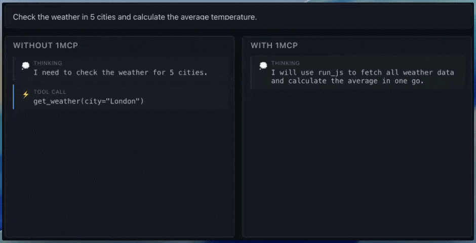

# 1mcp - avoid context bloating

1mcp lets agents compose MCP tool calls and run code safely via WASM, cutting token usage by [up to 96%](https://www.anthropic.com/engineering/code-execution-with-mcp).

[](https://1mcp.dev)

## How It Works

1mcp maps every MCP tool to sandboxed TypeScript stubs `mcp__mcpName_toolName.ts.d`, exposing only 4 core tools to the LLM. Instead of making individual MCP tool calls, agents write JavaScript code that chains MCP calls together, reducing token usage significantly. Instead of LLM making two separate tool calls, it can execute code, 1mcp dispatches calls, takes care of retries automatically. 

```javascript
const me = await github.getMe();
const repos = await github.listRepos({ username: me.login });
```

## Quick Start

Install globally, initialize configuration and start the server:

```bash
npm install -g 1mcp
1mcp init
1mcp serve
```

The server will start and expose MCP tools that can be used by your AI agent.

## Using with AI SDK

The `@onemcp/ai-sdk` package turns AI SDK tools into a sandboxed MCP surface:

```typescript
import { convertTo1MCP } from '@onemcp/ai-sdk';
import { generateText } from 'ai';
import { openai } from '@ai-sdk/openai';

const tools = {
  weatherTool : {
    name: "getWeather",
    async execute({ city, country }: { city: string; country: string }) {
      return { city, weather: "Sunny", temperatureC: 23 };
    },
  }
};

const { client, cleanup } = await convertTo1MCP(tools, {
  language: "js",
  npm: { dependencies: { "axios": "^1.6.0" }},
  policy: {
    network: {
      allowedDomains: ["api.weatherapi.com", "*.npmjs.org"]
    },
    filesystem: { writable: ["/tmp", "/out"] },
    limits: { memMb: 256 }
  },
  mcps: [{
      name: "external-mcp",
      url: "https://weather.example.com"
  }]
});

const mcpTools = await client.tools();

const result = await generateText({
  model: openai('gpt-4'),
  prompt: 'Get the weather for Paris, France',
  tools: mcpTools
});

// Clean up when done
await cleanup();
```

**Learn more:** See [examples/ai-sdk-integration](examples/ai-sdk-integration) for the full example.


## Available Tools

### Code Execution

Code is compiled to WASM using esbuild, then executed in a sandboxed QuickJS runtime (per session). You can opt-in to run code in the browser client or fall back to backend execution, both with policy-enforced safety.

- `run_js` – execute JavaScript/TypeScript that chains MCP calls

### Filesystem

Each MCP client session has a virtual filesystem (OPFS in the browser, or a sandboxed filesystem in the backend).

- `read` – fetch file contents inside the sandbox
- `write` – create or patch files with policy checks
- `search` – scan files without loading entire directories

```javascript
// Execution 1
const x = 42;
await write('/test.txt', 'hello');

// Execution 2 in same session
x; // ReferenceError - variables don't persist between executions
await read('/test.txt'); // file persists - filesystem state is maintained
```


## Why not just use Cloudflare/Vercel/Daytona sandboxes?

- **Chained execution = fewer tokens.** Inspired by Anthropic’s [“Code Execution with MCP”](https://www.anthropic.com/engineering/code-execution-with-mcp) pattern, 1mcp runs whole tool chains in a single capsule, so you see the same ~96% token reduction without hand-wiring Cloudflare Workers or Vercel Functions per call.
- **Capsules are just code.** You author TypeScript/JavaScript with whatever `npm` deps you want; 1mcp bundles them with esbuild and WASM, so there’s no provider-specific SDK (unlike Cloudflare/Vercel runtimes or Daytona sandboxes that expect their own APIs).
- **Session-scoped policies.** Each agent session gets strict network, filesystem, and runtime limits, rather than the global project settings Cloudflare/Vercel/Daytona enforce.
- **Browser execution to offload compute.** Capsules can run inside the client’s browser worker via SSE, letting you save server-side compute that Cloudflare/Vercel/Daytona would otherwise bill you for.
- **Native AI SDK bridge.** `@onemcp/ai-sdk` turns AI SDK tools into MCP tools automatically—no extra glue code—so your agent stays inside the same execution story across backend and browser.


### Browser Integration

The relay server proxies MCP tools to browser clients via SSE:

```typescript
import { RelayBrowserClient } from '@onemcp/ai-sdk/browser';

const client = new RelayBrowserClient('http://localhost:3000');
await client.connect();

client.onCapsule(async (capsule) => {
  // Execute capsule in browser worker and send results back
  const result = await executeInWorker(capsule);
  await client.sendResult(result);
});
```

The browser receives signed capsules (bundled code + policies), executes them in a sandboxed worker, and streams results back to the AI.

## Configuration Format

Define security policies and MCP servers in `1mcp.config.json`:

```json
{
  "language": "js",
  "npm": {
    "dependencies": {},
    "lockfile": ""
  },
  "policy": {
    "network": {
      "allowedDomains": ["api.github.com", "*.npmjs.org", "api.context7.com"],
      "deniedDomains": [],
      "denyIpLiterals": true,
      "blockPrivateRanges": true,
      "maxBodyBytes": 5242880,
      "maxRedirects": 5
    },
    "filesystem": {
      "readonly": ["/"],
      "writable": ["/tmp", "/out"]
    },
    "limits": {
      "timeoutMs": 60000,
      "memMb": 256,
      "stdoutBytes": 1048576
    }
  },
  "mcps": [
    {
      "name": "filesystem",
      "transport": "stdio",
      "command": "npx",
      "args": ["-y", "@modelcontextprotocol/server-filesystem", "/private/tmp"]
    },
    {
      "name": "sentry",
      "transport": "http",
      "endpoint": "https://mcp.sentry.dev/mcp"
    },
    {
      "name": "context7",
      "transport": "http",
      "endpoint": "https://api.context7.com/mcp"
    }
  ],
  "sessionTtlMs": 300000,
  "signingKeyPath": ".1mcp/keys/",
  "cacheDir": ".1mcp/capsules/"
}
```

### Policy Highlights

- **Network:** Control allow/deny lists, IP literals, private ranges, response body size, and redirect depth.
- **Filesystem:** Declare read-only versus writable mount points.
- **Limits:** Cap runtime (`timeoutMs`), memory (`memMb`), and stdout (`stdoutBytes`).

### Environment Variables & CLI Options

CLI flags override environment variables, which override config defaults.

| Setting | Env variable | CLI flag | Effect |
| --- | --- | --- | --- |
| Timeout | `TIMEOUT_MS` | `--timeout <ms>` | Maximum execution time |
| Memory | `MAX_MEMORY_MB` | `--max-memory <mb>` | Memory ceiling |
| Stdout | `MAX_STDOUT_BYTES` | `--max-stdout <bytes>` | Stdout buffer limit |

## CLI Reference

- `1mcp init [-c <path>]` – Initialize config (default `1mcp.config.json`).
- `1mcp serve [-c <path>] [--port <number>] [--bind <address>] [--no-ui|--open]` – Launch the MCP server.
